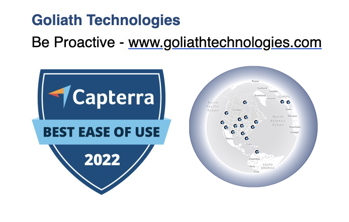

<div>
    <h1 style="color:#ff8502; display: inline;">

    GoliathCare Navigator!
 <!-- Goliath Technologies Mapping Tool -->
<!--  -->
<!--  -->
    </h1>
</div>

<!-- **Experience seamless mapping with the GoliathCare Navigator!**  -->
Designed to showcase healthcare facilities across the USA, Canada, the UK, Italy, and Aruba, this application provides a dynamic and intuitive interface for exploring locations utilizing Goliath Technologies solution software.

---

### <span style="color:#2E8B57;">Description</span>
The **GT Mapping Tool** is an interactive, client-focused application developed for [Goliath Technologies](https://goliathtechnologies.com/). It visualizes healthcare systems and their integration with Goliath's technology solutions, offering state and region-based interactivity. The tool is designed to simplify exploration through a user-friendly interface.


<!--  -->

### <span style="color:#2E8B57;">Features</span>

- **State-Level Markers**: Each state or region with a Goliath customer is represented by a single **"G" marker** for clarity.
- **Clickable States**: Click anywhere on a state to display healthcare facilities in that state.
- **Dynamic Sidebar**:
  - Lists one location per health system, grouped by **parent company**.
  - Displays critical details: Hospital name, location, parent company, and EHR system.
- **Responsive Design**:
  - Fully responsive with drag-and-drop sidebar functionality for ease of use on any device.
- **Clustering**: Groups facilities dynamically at higher zoom levels for improved performance.
- **Regional Coverage**: Includes the **USA**, **Canada**, the **UK**, **Italy** and **Aruba** supporting administrative regions and healthcare systems.
- **GoliathCare Navigator**:This project is a web application built using Mapbox GL JS to provide an interactive map experience. It demonstrates healthcare facilities using Goliath's solutions in various regions.

---

### <span style="color:#2E8B57;">Live Demo</span>

[Explore the GT Healthcare Facility Mapping Tool](https://gt-map.vercel.app/)

---

### <span style="color:#2E8B57;">Technical Implementation</span>

<!--  -->

#### Core Functionalities:
- **Region-Based Highlighting**: States and regions are highlighted on hover and clickable for deeper exploration.
- **Custom Data Management**: Facilities and regions are dynamically loaded using **GeoJSON**.
- **Dynamic Interactions**: Sidebars, markers, and popups update based on user interaction.
- **Accessibility**: Keyboard navigation and touch-friendly gestures are supported.


#### Technologies Used:
<div>  
  <a href="https://www.javascript.com/" target="_blank"></a>  
  <a href="https://en.wikipedia.org/wiki/HTML5" target="_blank"></a>  
  <a href="https://www.w3schools.com/css/" target="_blank"></a>  
  <a href="https://docs.mapbox.com/mapbox-gl-js/" target="_blank">
    
  </a>  
  <a href="https://nodejs.org/" target="_blank"></a>  
  <a href="https://github.com/" target="_blank"></a>  
</div>

---

### <span style="color:#2E8B57;">Setup & Installation</span>

Get the **Healthcare Facility Mapping Tool** running on your local machine:

1. Clone the repository:
   ```bash
   git clone https://github.com/your-username/healthcare-mapping-tool.git
   cd healthcare-mapping-tool
   ```

2. Install dependencies:
   ```bash
   npm install
   ```

3. Securely manage your **Mapbox API Token**:
   <!-- - Use environment variables or a secure configuration file to avoid exposing your token.
   - Add your token to an `.env` file or a secure storage system: -->
     ```bash
     REACT_APP_MAPBOX_TOKEN=your_mapbox_token
     ```

4. Run the development server:
   ```bash
   npm start
   ```

5. Open the app in your browser:
   ```
   http://localhost:8080
   ```

---

<!-- ### <span style="color:#2E8B57;">Feedback</span>

If you encounter any issues or have suggestions, please open an issue on the [GitHub issues page](https://github.com/your-repo-path/issues).

--- -->

<!-- ### <span style="color:#2E8B57;">Developed By</span> -->
<!-- 
<table>
    <tr>
        <td> Parvin A. Sattorova - Front-End Developer
            <a href="https://www.linkedin.com/in/parvin-sattorova-edwards-357526b3/">LinkedIn</a> || 
            <a href="https://github.com/Sulton88Mehron90">GitHub</a> 
        </td>
    </tr>
    <tr>
        <td></td>
    </tr>
</table> -->

### <span style="color:#2E8B57;">Disclaimer</span>
This project was developed as part of a collaboration with Goliath Technologies. The content and implementation presented here are for demonstration purposes only. Any proprietary data or business-sensitive information has been omitted.

### <span style="color:#2E8B57;">Developed By</span>
This project was collaboratively developed for Goliath Technologies as part of their initiative to improve visualization and access to healthcare facility data.

---

### <span style="color:#2E8B57;">License</span>

This project is licensed under the MIT License. See the [LICENSE](LICENSE) file for details.

<div align="right">
  <h1 style="color:red; display: inline;">
<!--     Thank you -->
    
     <!--   -->
  </h1>
</div>

